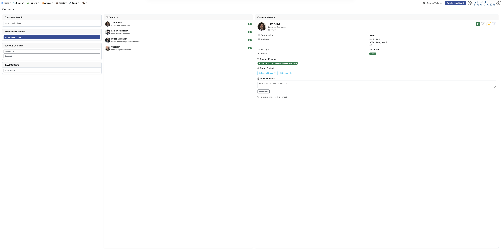
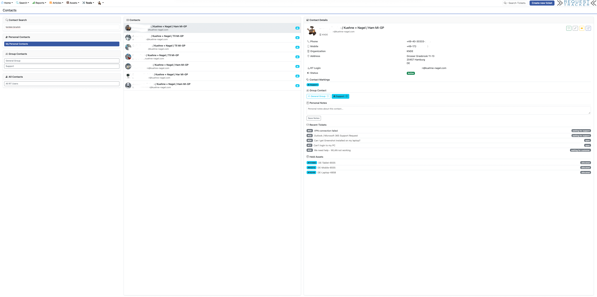
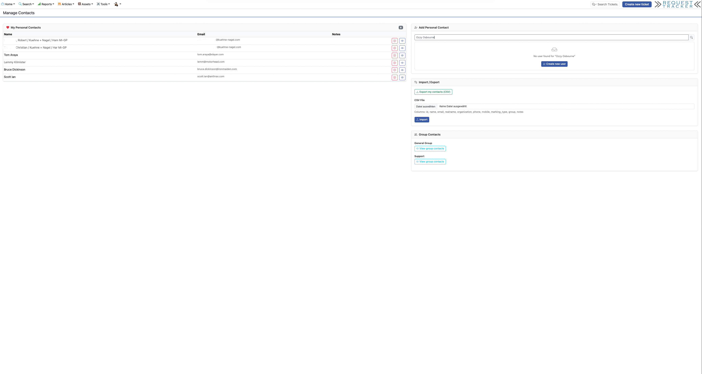
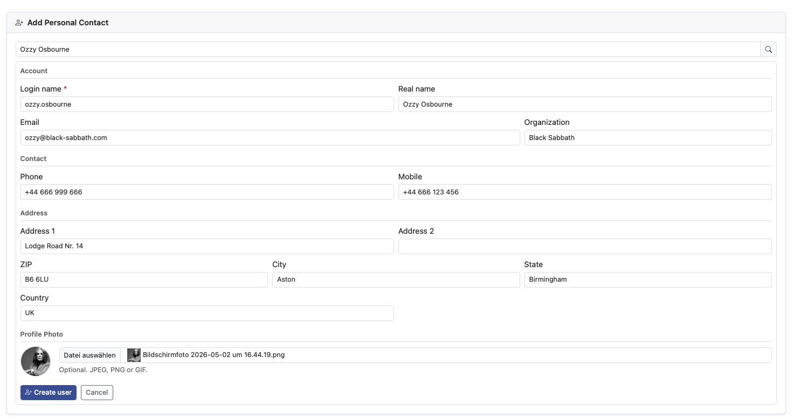

# RT-Extension-Contacts

A contacts management extension for **Request Tracker 6**. Adds a dedicated Contacts section to RT with a three-column layout, personal and group contact markings, live search, inline user creation and editing, and deep integration with tickets, assets and articles.

## Screenshots

### Contacts Page (Tools menu)

Three-column layout: filter sidebar (search, personal, group, all), contact list with avatars, and contact detail pane with full address, markings, notes, recent tickets and held assets.



### Group Contacts with Detail View

Group contact filter active — detail pane shows all contact fields, group/personal markings, recent tickets and held assets.



### Manage Contacts Page

Overview of personal contacts with inline search, CSV import/export and group contact management.



### Inline User Creation

When a search returns no match, an inline form opens directly in the page — no navigation away. Covers all RT user fields including profile photo upload with live preview.



---

## Features

- **Three-column contacts page** (Tools menu): filter sidebar, contact list, detail pane — all updated dynamically via HTMX, no full page reloads
- **Personal contacts**: mark any RT user as a personal contact, add private notes
- **Group contacts**: assign contacts to RT groups you belong to
- **Live search**: filter by name, email or phone across all RT users
- **Contact detail pane**: phone, mobile, address, organization, status badge, profile photo, recent tickets, held assets, recently updated articles
- **Inline user creation**: create new RT users (with all address fields and profile photo upload) without leaving the Contacts page
- **Inline user editing**: edit any user's data and photo directly in the detail pane (pencil icon)
- **Create ticket**: one-click button pre-fills the new ticket form with the contact as requestor
- **Manage Contacts page** (user menu): view and remove personal contacts, search and add new ones, import and export CSV
- **CSV export**: personal contacts or all contacts as downloadable CSV
- **CSV import**: bulk-import contacts from CSV file
- **Bootstrap 5.3 / dark-mode aware**: uses `var(--bs-*)` CSS variables throughout, `[data-bs-theme=dark]` overrides for dark mode
- **RT user images**: profile photos via RT's native `/Helpers/UserImage/` endpoint

---

## Requirements

- Request Tracker **6.0.x**
- MySQL / MariaDB (InnoDB, utf8mb4)
- RT's built-in Bootstrap 5.3, HTMX and Bootstrap Icons (all included in RT 6)

---

## Installation

### 1. Copy files to the RT plugin directory

```bash
rsync -av RT-Extension-Contacts/ /opt/rt6/local/plugins/RT-Extension-Contacts/
```

> There is no `make install` step — the extension is deployed by copying files directly. The `Makefile.PL` is included for completeness but not required for deployment.

### 2. Register the plugin in `RT_SiteConfig.pm`

```perl
Plugin('RT::Extension::Contacts');
```

### 3. Clear Mason cache and restart the web server

```bash
sudo systemctl stop apache2
sudo rm -rf /opt/rt6/var/mason_data/obj/*
sudo systemctl start apache2
```

The database table (`contact_markings`) is created automatically on first load via `CREATE TABLE IF NOT EXISTS`.

---

## Database Schema

One additional table is created automatically:

```sql
CREATE TABLE IF NOT EXISTS contact_markings (
    id            INTEGER      NOT NULL AUTO_INCREMENT,
    user_id       INTEGER      NOT NULL,   -- RT User being marked
    marked_by     INTEGER      NOT NULL,   -- RT User who marked
    marking_type  VARCHAR(16)  NOT NULL DEFAULT 'personal',  -- 'personal' | 'group'
    group_id      INTEGER      NOT NULL DEFAULT 0,           -- RT Group id (0 for personal)
    notes         TEXT,                   -- private notes (personal contacts only)
    created       DATETIME     NOT NULL,
    last_updated  DATETIME     NOT NULL,
    PRIMARY KEY (id),
    UNIQUE KEY uniq_marking (user_id, marked_by, marking_type, group_id),
    INDEX idx_marked_by (marked_by),
    INDEX idx_user_id   (user_id),
    INDEX idx_group_id  (group_id)
) ENGINE=InnoDB DEFAULT CHARSET=utf8mb4;
```

No existing RT tables are modified.

---

## Permissions

Four new rights are registered, all scoped to `RT->System`:

| Right | Category | Description |
|-------|----------|-------------|
| `SeeContacts` | Staff | View the Contacts page and search contacts |
| `ManagePersonalContacts` | Staff | Mark/unmark RT users as personal contacts, add personal notes |
| `ManageGroupContacts` | Staff | Mark/unmark RT users as group contacts |
| `AdminContacts` | Admin | Full access to contact markings, import and export |

### Recommended grants

Grant via the RT Admin → Global → Group Rights panel, or via script:

```perl
use RT;
RT->LoadConfig;
RT->Init;

my $privileged = RT::Group->new(RT->SystemUser);
$privileged->LoadSystemInternalGroup('Privileged');

for my $right (qw(SeeContacts ManagePersonalContacts ManageGroupContacts)) {
    $privileged->PrincipalObj->GrantRight(Right => $right, Object => RT->System);
}
```

The `AdminContacts` right (import/export) should be granted to admin groups only.

> **Note:** Inline user creation (`ManageCreateUser`) and inline user editing (`ContactEditPane`) additionally require the RT built-in `AdminUsers` right.

---

## File Structure

```
RT-Extension-Contacts/
├── Makefile.PL
├── Changes
├── README.md
│
├── lib/
│   └── RT/
│       └── Extension/
│           └── Contacts.pm          # Main module: rights, schema, all API methods
│
├── html/
│   ├── Callbacks/
│   │   └── RT-Extension-Contacts/
│   │       └── Elements/Header/
│   │           └── PrivilegedMainNav  # Injects menu items (Tools + user dropdown)
│   │
│   └── Contacts/
│       ├── index.html               # Main contacts page (3-column layout)
│       ├── Manage.html              # Manage Contacts page
│       └── Partials/
│           ├── ContactListPane      # HTMX: contact list (search/filter/paginate)
│           ├── ContactDetailPane    # HTMX: contact detail view
│           ├── ContactEditPane      # HTMX: inline user edit form
│           ├── MarkContact          # HTMX action: add/remove/update markings
│           ├── ManageContactSearch  # HTMX: search within Manage page
│           ├── ManageCreateUser     # HTMX: inline new user creation form
│           ├── ExportCSV            # Direct download: CSV export
│           └── ImportCSV            # HTMX: CSV import form + handler
│
├── static/
│   ├── css/
│   │   └── contacts.css            # Layout, avatar colours, dark-mode overrides
│   └── js/
│       └── contacts.js             # Avatar colourisation, active states, HTMX hooks
│
└── etc/
    ├── content                     # RT initialdata (empty placeholder)
    └── initialdata                 # RT initialdata (empty placeholder)
```

---

## API Reference (`RT::Extension::Contacts`)

| Method | Arguments | Returns | Description |
|--------|-----------|---------|-------------|
| `GetPersonalContacts` | `$viewer_id` | `ArrayRef[HashRef]` | All personal contact markings for a user |
| `GetGroupContacts` | `$group_id, $viewer_id` | `ArrayRef[HashRef]` | All contacts in a group |
| `GetContactMarkings` | `$user_id, $viewer_id` | `ArrayRef[HashRef]` | All markings on a specific contact visible to viewer |
| `IsPersonalContact` | `$contact_id, $viewer_id` | `Bool` | Whether contact is marked personal by viewer |
| `IsGroupContact` | `$contact_id, $group_id` | `Bool` | Whether contact is in a group |
| `AddPersonalContact` | `$user_id, $marker_id, $notes` | `($ok, $msg)` | Mark a user as personal contact |
| `RemovePersonalContact` | `$user_id, $marker_id` | — | Remove personal marking |
| `AddGroupContact` | `$user_id, $group_id, $adder_id, $notes` | `($ok, $msg)` | Add to group |
| `RemoveGroupContact` | `$user_id, $group_id` | — | Remove from group |
| `GetUserGroups` | `$user_id` | `ArrayRef[HashRef]` | RT groups the user belongs to |
| `GetRecentTickets` | `$contact_id, $limit` | `ArrayRef[HashRef]` | Recent tickets (requestor or owner) |
| `GetRecentAssets` | `$contact_id, $limit` | `ArrayRef[HashRef]` | Assets held by this user |
| `GetRecentArticles` | `$contact_id, $limit` | `ArrayRef[HashRef]` | Articles last updated by this user |
| `SearchUsers` | `$query, $limit` | `RT::Users` | Live search across Name, RealName, EmailAddress |
| `GetAllContacts` | `$limit, $offset` | `RT::Users` | Paginated list of all enabled RT users |

---

## HTMX Fragment Pattern

All partials return full RT pages (autohandler runs → session and CSRF are handled correctly). HTMX extracts only the relevant fragment using `hx-select`:

| Target div ID | Used by |
|---------------|---------|
| `#contacts-list-content` | `ContactListPane` |
| `#contacts-detail-content` | `ContactDetailPane`, `ContactEditPane` |
| `#manage-search-results` | `ManageContactSearch`, `ManageCreateUser` |

This avoids `inherit => undef` (which breaks `%session`) while keeping RT's autohandler authentication intact.

---

## Navigation Integration

The `PrivilegedMainNav` callback injects two menu items:

- **Tools → Contacts** (`/Contacts/`) — visible to users with `SeeContacts`
- **User menu → Manage Contacts** (`/Contacts/Manage.html`) — visible to users with `SeeContacts`

---

## CSV Format

Export and import use the following column order:

```
id, name, email, realname, organization, phone, mobile, marking_type, group, notes
```

All fields are double-quoted. Import matches users by email address.

---

## Known Limitations

- MySQL / MariaDB only (uses `AUTO_INCREMENT`, `InnoDB`, `utf8mb4`)
- Group contacts are visible to all members of that group (no per-member visibility control)
- Asset search uses direct SQL join (not RT's SearchBuilder) for reliability with the `HeldBy` role

---

## License

GNU General Public License v2 — see [https://www.gnu.org/licenses/old-licenses/gpl-2.0.html](https://www.gnu.org/licenses/old-licenses/gpl-2.0.html)

## Author

Torsten Brumm
